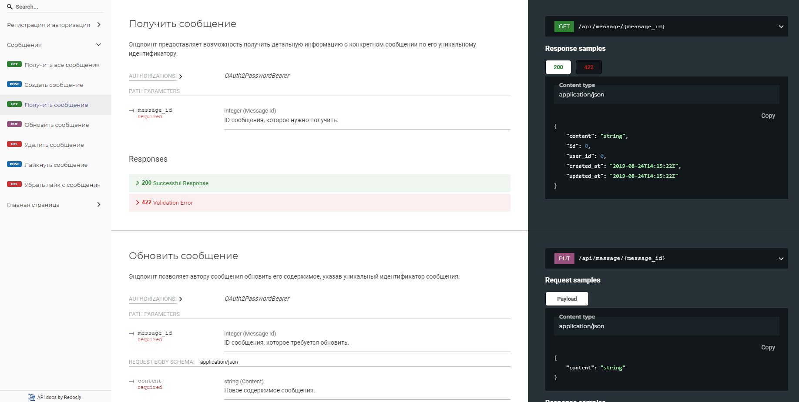

# Networking App
[О проекте](#О-проекте) • [Стек](#Стек) • [Установка](#Установка) • [Запуск приложения](#Запуск-приложения) • [Эндпоинты](#Эндпоинты) • [Модели данных](#Модели-данных) • [Токен JWT](#Токен-JWT) • [Лицензия](#Лицензия) • [Контакты](#Контакты)

## О проекте
Это проект сетевого приложения, созданный с использованием FastAPI и SQLAlchemy для работы с базой данных. В данном проекте реализованы основные функции, такие как аутентификация пользователей, обработка сообщений и "лайков".

---

## Стек
FastAPI • FastAPI-Users • SQLAlchemy • Pydantic • SQLite • JWT • ASGI

## Установка
Склонируйте репозиторий с GitHub:

```
git clone https://github.com/alexromantsov/networking_fastapi.git
```

Перейдите в директорию проекта:
```
cd networking_fastapi
```

Создайте и активируйте виртуальное окружение (необязательно, но рекомендуется):
```
python3 -m venv venv
source venv/bin/activate  # На Windows используйте `venv\Scripts\activate`
```

Для работы с проектом вам понадобятся Python 3.8 и выше, а также несколько пакетов, которые можно установить через pip, используя файл requirements.txt:
```bash
pip install -r requirements.txt
```

Выполните миграцию базы данных (используется SQLite, но при желании легко можно изменить на другую SQL систему):
```bash
alembic upgrade head
```
---

## Запуск приложения

Для запуска приложения находясь в папке 'networking_fastapi' выполните следующий код:
```bash
uvicorn main:app --reload
```

После запуска приложения вы можете просмотреть документацию API по следующим адресам:
* Swagger UI: http://localhost:8000/docs
* ReDoc: http://localhost:8000/redoc

_Пример окна с документацией_



---

## Эндпоинты

* /auth - эндпоинт аутентификации, обрабатывает все, что связано с регистрацией и входом в систему.
* /api/message - эндпоинт для работы с сообщениями.

Добавить картинки
---

## Модели данных

* User - модель пользователя, содержащая информацию о зарегистрированных пользователях.
* Message - модель сообщения, которую используют для обмена сообщениями.
* Like - модель "лайка", которая хранит информацию о том, какие пользователи "лайкают" какие сообщения.

---

## Токен JWT
Приложение использует JWT-токены для аутентификации пользователей. Все запросы к эндпоинтам, требующим аутентификации, должны включать в себя заголовок Authorization: Bearer {token}, где {token} - это JWT-токен пользователя.

---

## Лицензия
Этот проект распространяется под лицензией MIT. Подробнее см. в файле [LICENSE](LICENSE).

---

## Контакты
Если у вас возникли вопросы, пожалуйста, свяжитесь с нами по электронной почте: 
<div>
    <div style="float: left; padding-top: 20px;">
        
    </div>
    <div style="float: left; padding-top: 20px;">
        <h3><a style="text-decoration: none; color: #696969" href="mailto:alekseyromantsov@gmail.com">Алексей Романцов<br></a></h3>
        👨‍💻 Все проекты: <a href="https://github.com/alexromantsov" target="_blank">https://github.com/alexromantsov</a> <br>
        👔 LinkedIn: <a href="https://www.linkedin.com/in/alexromantsov" target="_blank">https://www.linkedin.com/in/alexromantsov</a> <br>
        📞 Телефон: +7 (908) 209-39-99
    </div>
</div>